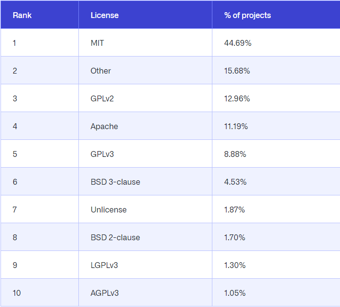

# Glossario

Coleção de palavras e/ou expressões sobre o direito digital

## **Áreas de atuação do direito digital**

**Contencioso:** lida com a representação de pessoas que foram alvos de algum tipo de vazamento ou roubo de informações pessoas de uma vítima.

**Consultoria:** pode oferecer consultoria a essas pessoas e empresas, apresentando como que a organização pode enquadrar as suas atividades com o que estipula a lei, agindo de forma preventiva.

**Processos criminais:** addvogado que lida com processos crimianis relacionados a area digital, com conhecimento em direito penal e tecnologia.

**Contratos:** criação de contratos e contemplando as particularidades das organizações que estabelecem suas atividades pela internet.

## **Autorregulamentação e Solução de conflitos**

**Autorregulamentação:** Acto ou efeito de se auto-regulamentar ou de estabelecer os seus próprios regulamentos ou normas. Através desse princípio, um grupo de pessoas ou organizações estabelece um conjunto de regras que visam garantir qualidade, segurança e responsabilidade diante de seus serviços e/ou produtos.

Descreve um grupo de pessoas ou organizações que exercem todas as funções necessárias de poder sem a intervenção de qualquer autoridade maior que os limite

**Solução de conflitos:** Processos judiciais podem demorar alguns anos para serem julgados, por isso os meios alternativos de solução de conflitos vêm ganhando espaço entre os operadores do Direito.

O uso de outros métodos para a resolução de disputas colabora para o alcance de soluções mais efetivas, justas e rápidas. A conciliação, a mediação, a arbitragem e a autocomposição são meios de resolução dos conflitos não impostos pelo Judiciário

## **Código de defesa do consumidor**

É o ramo do direito que lida com as relações jurídicas entre fornecedores de bens e serviços e seus consumidores.

## **Conceitos Basicos**

Direitos da personalidade são todos aqueles direitos que permitem que uma pessoa realize a sua individualidade e possa defender aquilo que é seu.

**Direito à privaciade:** São inviolaveis a intimidade, a vida privada, a honra e a imagem das passoas, assegurado o direito a indenização pelo dano material ou moral decorrente de sua violação. É portanto, a exclusão do conhecimento alheio em relação aquilo que só diz respeito à própria pessoa, especialmente, quanto ao seu modo de ser. É o direito de estar só.

**Direito de imagem e honra:** É um direito fundamental, prevendo indenização para o caso de sua violação. O código civil também traz regras sobre o direito de imagem e o classifica como um direito da personalidade. O art. 20 veda a exposição ou utilização da imagem de alguém sem permissão, caso o uso indevido atinja a sua honra, boa-fama, respeito ou se destine a fins comerciais. Contudo, há situações em que não é necessario a permissão, por exemplo, na administração da justiça ou à manutenção da ordem pública. Em casos mais graves o uso indevido pode ser considera um crime como previsto no artigo 218C do código penal.

**Direito anonimato:** O art.5, IV, da CF/88, diz que é livre a manifestação do pensamento, sendo vedado o anonimato. Intrinsecamente ligado ao direito de liberdade de expressão. É vedado o anonimato, salvo em casos de denúncias e ouvidorias de acordo com lei infraconstitucional.

**Direito à informação:** No art. 6, III, do CDC, prevê como direito básico do consumidor a obtenção de informação adequada sobre diferentes produtos e serviços. Posteriormente a Lei do E-commerce (Decreto Federal nº 7.962/2013) regulamentou o Código de Defesa do Consumidor em relação ao comércio eletrônico.

**Direito ao sigilo:** Refere-se aos fatos específicos que não convém ser divulgados, seja por razões pessoais, proficionais ou comerciais. o direito ao sigilo constitui um aspecto particular do direito à intimidade. É normal que a pessoa almeje que determinadas manifestações permaneçam inacessíveis ao conhecimento dos outros, ou seja, secretas. Assim em muitas hipóteses é ilícito não apenas divulgar tais manifestações, mas também o simples tomar conhecimento delas e ou revelá=las, não importa a quantas pessoas.

**Direito de igualdade:**  O art. 5, I, da CF/88 estabelece que todos são iguais perante a lei. Significa que as necessidades de cada pessoa têm igual importância. Garantir que todas as pessoas tenham as mesmas oportunidades de participação. 

O princípio da igualdade pressupõe que as pessoas colocadas em situações diferentes sejam tratadas de forma desigual: "Dar tratamento isonômico às partes significa tratar igualmente os iguais e desigualmente os desiguais, na exata medida de suas desigualdades". (Nery Junior, 1999, p. 42).

**Direito à segurança:** O art. 6, I, do CDC dispôe que o consumidor possui o direito básico de proteção à sua vida, saúde e segurança contra os riscos provocados por práticas no fornecimento de produtos e serviçoes considerados perigosos ou nocivos. Proteção a vida, saúde e segurança são direitos fundamentais inalienáveis, indisponíveis e indissociáveis, previstos no artigo 5° da constituição federal. A segurança faz parte do rol dos direitos fundamentais dos indivíduos, necessário ao natural desenvolvimento da personalidade humana e ao aperfeiçoamentp da vida em sociedade.

**Linha do tempo:**

Código de Defesa do Consumidor (1990) -> Lei do E-commerce (2013) -> Marco Civil da Internet (2014) -> Lei Geral de Proteção de Dados Pessoais (2018)

**O que é dado pessoal:** Informação relacionada a pessoa natural identificada ou identificavel (Segundo a LGPDP).

**Dados Pessoais VS Dados Pessoais Sensiveis:** 
- **Dados Pessoais:** Nome, endereço, número de indentificação, etc...
- **Dados Pessoais Sensiveis:** Origem racial, optiniôes politicas, dados medicos, etc...

## **Diferenças entre Leis, Normas e Regulamentos**

**Leis:** É uma norma ou conjunto de normas jurídicas criadas através dos processos próprios do ato normativo e estabelecidas pelas autoridades competentes para o efeito. 

Regra, prescrição escrita que emana da autoridade soberana de uma dada sociedade e impõe a todos os indivíduos a obrigação de submeter-se a ela sob pena de sanções.

É uma regra obrigatorio.

**Regulamentos:** Ato ou efeito de regular, de estabelecer regras. Estatuto, instrução que prescreve o que deve ser feito. Conjunto de normas.

**Normas:** Aquilo que regula procedimentos ou atos; regra, princípio, padrão, lei.

Um padrão ou costume estabelecido, boas praticas.

## **Empresas Virtuais**

**O que é:** Também chamada de ILTDA ou i-LTDA, é um tipo de entidade econômica que se realiza principalmente via Internet.

**Vantagens:**
- Baixo custo
- Disponibilidade
- Praticidade na compra
- Acessibilidade
- Detalhes

**Desvantagens:**
- Atendimento
- Experiência
- Atrasos
- Sistema antifraude

## **Importância do Direito Digital**

A grande maioria das informações de pessoas, organizações e governos do mundo inteiro está contida atualmente na internet. Continuidade da economia e das sociedades está intrinsicamente à rede mundial de computadores. Área não só fundamental para a continuidade da evolução tecnológica e sua coabitação com o desenvolvimento humano, mas também crítica para a proteção desses dados e informações valiosíssimos para esses grupos.

## **Leis**

**Lei Carolina Dieckmann (lei nº 12.737/2012):** Primeira lei e traz em seu texto a tipificação de crimes informáticos, alterando o Código Penal de acordo. Uso indevido de dados pessoais, principalmente de serviços prestados. Penas para crimes como invasão de aparelhos eletrônicos, interrupção de serviços digitais ou de conexão, falsificação de documentos ou de cartões de crédito ou débito.

**Marco Civil da Internet (lei nº 12.965/2014):** Segunda lei e estabelece princípios, garantias, direitos e deveres para o uso da internet no Brasil, além de estipular diretrizes para a ação do Estado dentro das redes e preservar valores como liberdade de expressão, neutralidade e privacidade.

**Lei Geral de Proteção de Dados Pessoais (LGPDP) (lei nº 13.709/2018):** Terceira lei e mais relevante. Tem como objetivo específico resguardar os dados pessoais de pessoas e empresas que estão dentro da internet. Garante maior transparência das empresas com o público, mostrando como utilizam dados pessoais dos indivíduos. Criação de um orgão para monitoramento e fiscalização (Agência Publica de Proteção de Dados (ANPD))

## **Licenças de Software**

**O que é e para que serve:** Uma licença de software, ou licença de programa de computador, é uma definição de ações autorizadas, no âmbito do direito de um programador de software de computador concedidas ao usuário deste software. É o documento que define os limites de uso que um usuário pode ter em relação a um produto de terceiros.

**Tipos de software:**
- **Software Proprietário:** O software proprietário, privativo ou não livre, é um software para computadores que é licenciado com direitos exclusivos para o produtor. Conforme o local de distribuição do software este pode ser abrangido por patentes, direitos de autor assim como limitações para a sua exportação e uso em países terceiros
- **Software de Domínio Público:** Software de domínio público é software não sujeito a copyright. Se o código fonte estiver no domínio público, este é um caso especial de software livre sem copyleft, o que significa que algumas cópias ou versões modificadas podem não ser livres.
- **Adware:** Adware é qualquer programa de computador que executa automaticamente e exibe uma grande quantidade de anúncios sem a permissão do usuário. As funções do adware servem para analisar os locais de Internet que o usuário visita e lhe apresentar publicidade pertinente aos tipos de bens ou serviços apresentados lá.
- **Freeware:** Software gratuito ou freeware é qualquer programa de computador cuja utilização não implica o pagamento de licenças de uso ou royalties. É importante não confundir o free de freeware com o free de free software, pois no primeiro uso o significado é de gratuito, e no segundo de livre.
- **Shareware:** Shareware é um programa de computador disponibilizado gratuitamente, porém com algum tipo de limitação.
- **Software de código aberto:** Software de código aberto é o software de computador com o seu código fonte disponibilizado e licenciado com uma licença de código aberto no qual o direito autoral fornece o direito de estudar, modificar e distribuir o software de graça para qualquer um e para qualquer finalidade.

**Tipos de licença:**
- **GNU General Public License:** GNU General Public License, GNU GPL ou simplesmente GPL, é a designação da licença de software para software idealizada por Richard Matthew Stallman em 1989, no âmbito do projeto GNU da Free Software Foundation. Sendo uma licença copyleft, trabalhos derivados de um produto originalmente licenciado pela GPL só podem ser distribuídos se utilizarem a mesma licença. Isso é diferente das licenças permissivas como a licença BSD e a licença MIT, que possuem exigências mais simples. São utilizadas por projetos de software livre e de código aberto. Além dos programas de software produzidos pelo Projeto GNU. A licença se baseia em 4 liberdades, são elas: 
  - A liberdade de executar o programa, para qualquer propósito (liberdade nº 0)
  - A liberdade de estudar como o programa funciona e adaptá-lo às suas necessidades (liberdade nº 1). O acesso ao código-fonte é um pré-requisito para esta liberdade.
  - A liberdade de redistribuir cópias de modo que você possa ajudar ao seu próximo (liberdade nº 2).
  - A liberdade de aperfeiçoar o programa e liberar os seus aperfeiçoamentos, de modo que toda a comunidade beneficie deles (liberdade nº 3). O acesso ao código-fonte é um pré-requisito para esta liberdade.

  Exemplos: Núcleo Linux. 
- **GNU FDL:** GNU Free Documentation License é uma licença para documentos e textos livres publicada pela Free Software Foundation. É inspirada na GNU General Public License, da mesma entidade, que é uma licença livre para software. Permite que textos, apresentações e conteúdo de páginas na internet sejam distribuídos e reaproveitados, mantendo, porém, alguns direitos autorais e sem permitir que essa informação seja usada de maneira indevida.
- **GNU LGPL:** A GNU Lesser General Public License, escrita em 1991, é uma licença de software livre aprovada pela FSF e escrita como um meio-termo entre a GPL e licenças mais permissivas, tais como a licença BSD e a licença MIT. Permite também a associação com programas que não estejam sob as licenças GPL ou LGPL.
- **GNU AGPL:** A GNU Affero General Public License, ou simplesmente GNU Affero GPL, é uma licença de software livre publicada recentemente pela Free Software Foundation. Tem o propósito de ser uma licença minimamente modificada da GNU GPL e atender as necessidades de fornecer liberdade em softwares como serviços (SaaS, Software as a Service), ou seja, aqueles aos quais não se tem acesso direto ao binário/código-objeto.
- **Licença livre:** Licença livre é toda licença que garante ao receptor de uma obra protegida por direito autoral, as liberdades de utilizar e gozar dos benefícios de seu uso, copiar e distribuir, estudar e modificar, e distribuir modificações daquela obra.
- **Copyleft:** Copyleft é uma forma de usar a legislação de proteção dos direitos autorais com o objetivo de retirar barreiras à utilização, difusão e modificação de uma obra criativa devido à aplicação clássica das normas de propriedade intelectual, exigindo que as mesmas liberdades sejam preservadas em versões modificadas.

**Principais licenças utilizadas no Github:**
Ranking das licenças mais utilizadas no github em 2015.

## **O que é Compliance**

É um conjunto de mecanismos e procedimentos voltados à proteção da integridade e da ética das empresas, com o incentivo institucional à denúncia de irregularidades para apuração e punição.

- Combater "corrupção"
- garantir integridade
- Garantir transparência (vertical e horizontal)

No Brasil, a edição da **Lei Federal 12.846/2013 (Lei Anticorrupção ou Lei da Probidade Empresarial)** levantou esforços na prevenção e combate a práticas ilícitas praticadas contra a Administração Pública.

**Complaince e o Direito:** Profissional de Direito pode atuar na condução e implementação de programas de compliance nas empresas como um orientador das exigências legais.

**Complaince e a LGDP:** Para a segurança de dados e combater a "corrupção" nas empresas

## **O que é Direito Digital**

Ramo do direito que tem como objetivo proporcionar as normatizações e regulamentações do uso dos ambientes digitais pelas pessoas, além de oferecer proteção de informações contidas nesses espaços e em aparelhos eletrônicos.

## **Outsourcing/Terceirização**

**O que é:** Outsourcing (ou terceirização) é transferir tarefas, operações, trabalhos ou processos para uma força de trabalho externa, contratando terceiros por um período de tempo determinado.

**Vantagens:**
- Estrutura mais enxuta
- Redução de custos
- Maior eficiência
- Melhor qualidade na atividade terceirizada
- Flexibilidade do setor
- Redução de custos com manutenção
- Maior foco no objetivo do negócio

**Desvantagens:**
- Dificuldade na integração das atividades
- Dificuldade na gestão dos processos
- Dependência
- Objetivos desalinhados
- Maiores custos

## **Tipos de Documentos Eletrônicos**

**Documento Eletrônico:** Um documento eletrônico é acessível e interpretável por meio de um equipamento eletrônico, podendo ser registrado e codificado em forma analógica ou em dígitos binários. Um documento digital pode ser um documento digitalizado ou um documento nato digital.

Exemplos: 
- Documentos originalmente fisicos que foram escaneados e digitalizados
- Fita VHS
- CD
- DVD

**Documento Digital:** É um documento eletrônico acessado por meio de sistema computacional. Todo documento eletrônico é um documento digital.

Exemplos:
- CNH
- E-Titulo

Precisa ter:
- Proprietario/remetente 
- Não alteravel/Integridade
- Verificavel (empresa geradora do serviço ou no portal do governo ITI)

**Assinatura Eletrônica:** Permite assinar documentos sem precisar do certificado digital. Atraves de selfie, botão condordo, escrever o nome, etc...

**Assinatura Digital:** A Assinatura Digital equivale a uma assinatura de próprio punho. É uma tecnologia que utiliza a criptografia e vincula o *certificado digital* ao documento eletrônico que está sendo assinado. Assim, dá garantias de integridade e autenticidade do documento.
- Segurança: Criptografica por chave hash (algoritmos MD5, SHA, ....)

**Certificação Digital:** Certificado digital é um documento eletrônico que contém dados sobre a pessoa física ou jurídica que o utiliza, servindo como uma identidade virtual que confere validade jurídica e aspectos de segurança digital em transações digitais. Permite assinar documentos à distância com o mesmo valor jurídico da assinatura feita de próprio punho no papel, mas sem precisar reconhecer firma em cartório.

Exemplos de provedores:
- CertiSign
- DocuSign
- AdobeSign
- ClickSign

## Referencias

[Direito Digital](https://www.projuxaris.com.br/direito-digital/)

[Compliance 1](http://genjuridico.com.br/2019/09/03/o-que-e-compliance-direito/)

[Compliance 2](https://www.totvs.com/blog/negocios/compliance/)